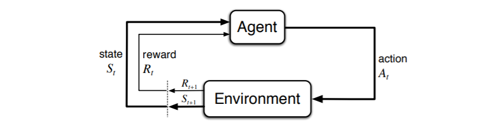
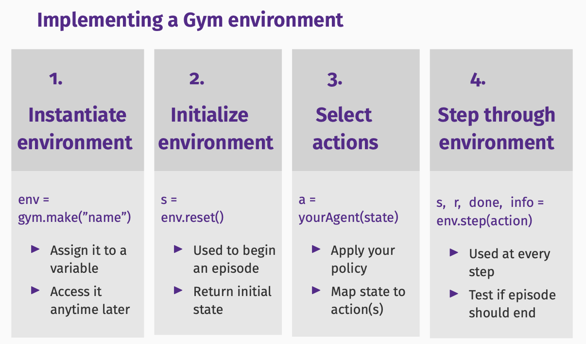

# <span style="color:red"><strong> Introduction of Reinforcement Learning </strong></span>

## Definition

Reinforcement learning is a method to capture the most important aspects of the real problem facing a learning agent interacting over time with its environment to achieve a goal. A learning agent must be able to sense the state of its environment to some extent and must be able to take actions that affect the state. The agent also must have a goal or goals relating to the states of the environment. 

To put it another way, through a series of trial and error methods, an agent keeps learning continuously in an interactive environment from its own actions and experience. The only goal of it is to find a suitable action model which would increase the total cumulative reward of the agent. It learns via interaction and feedback.

## The Difference Between RL and Supervised Learning / Unsupervised Learning

RL differs from supervised learning in a way that in supervised learning the training data has the answer key with it so the model is trained with the correct answer itself whereas in RL, there is no answer but the reinforcement agent decides what to do to perform the given task. In the absence of a training dataset, it is bound to learn from its experience.

RL also differs from unsupervised learning in the sense that it is trying to maximize a reward signal instead of trying to find hidden structure. Uncovering structure in an agent's experience can certainly be useful in RL, but by itself does not address the RL problem of maximizing a reward signal.

## Elements of RL

<center></center>

[Image source](https://web.stanford.edu/class/psych209/Readings/SuttonBartoIPRLBook2ndEd.pdf)
<br>

The agent is the learner and decision-maker of the model to do the job specified. The environment is the world with which the agent interacts and performs actions based on the information it has learned. The agent receives state $S_0$ from the environment, and subsequently, the agent and the environment interact continually. The agent selects actions, and the environment responds to those actions and presents new situations to the agent.

The action is a move made by the agent, which causes a status change in the environment. The agent's way of taking actions at a given time is defined by policy, which is a mapping from perceived states of the environment to actions to be taken when in those states. The best action is decided based on the maximum reward. 
A reward is the evaluation of an action given by the environment and can be positive or negative. The fundamental goal of RL problem is to select actions to maximize the total reward it receives over the long run. 

Whereas the reward signal indicates what is good in an immediate sense, a value function specifies what is good in the long run. Roughly speaking, the value of a state is the total amount of reward an agent can expect to accumulate over the future, starting from that state. For example, a state might always yield a low immediate reward but still have a high value because it is regularly followed by other states that yield high rewards. 

Note that rewards are in a sense primary, whereas values, as predictions of rewards, are secondary. Without rewards there could be no values, and the only purpose of estimating values is to achieve more reward. Nevertheless, it is values with which we are most concerned when making and evaluating decision. Action choices are made based on value judgements. 

## Approaches to an RL Problem

An RL problem can be approached in many ways:

* There is no policy function in a **value-based** RL approach, and the aim is to greedily select actions to maximize a value function $V(s)$.
* In a **policy-based** approach, the action performed at each state to gain maximum reward in the future is based on a policy function. Here, no value function is involved. The policy function can be deterministic, which produces the same action A at any state, or stochastic, where each action A has a certain probability of occurrence. 
* A **model-based** approach generates a virtual model for each environment, and the agent learns to produce actions in that specific environment. Since the model differs for each environment, there is no singular solution or algorithm for this approach.

## Challenges & Opportunities of RL

* **Control vs. Prediction**: How to search for the optimal policies and estimate their values simultaneously?
* **Exploration vs. Exploitation**: An agent must explore to find information, yet must exploit known information to get reward.
* **Generalization to large state-action spaces**: For example, the game Go has over $10^{70}$ possible positions.
* **Combining learning with planning**: In addition to interact with the environment, an agent can learn and plan from a model.
* **Simulated vs. Real Experience**: Trial-and-error impractical.
* **Other forms of learning**: From rewards? From demonstrations? Imitations? Supervisions? What does Psychology teach us?
* **Convergence vs. Tracking and Adaptability**

## Implementing an RL Model

OpenAI Gym is a framework for developing RL algorithms. OpenAI Gym provides various game environments in which the agent can take action. Each environment has an initial status, and the status is updated each time the agent take actions.

<center></center>

### Resources:

* The original paper of Gym: https://arxiv.org/pdf/1606.01540.pdf
* Gymnasium Documentation: https://gymnasium.farama.org/

### Gymnasium Setup with Python

```
##install libraries

conda create --name py39 python=3.9
pip install gym
pip install gymnasium
```

```
##create a virtual environment as a kernel 

conda activate py39
pip install ipykernel
python -m ipykernel install --user --name=py39
```

Gym is a toolkit for developing and comparing reinforcement learning (RL) algorithms. It offers pre-built, baseline RL environments within which a developer can build and test RL algorithms. 

At the most fundamental level, using the Gym library means 1) selecting an environment, and 2) interacting with it:

* Gym offers many different environments to select, from classic control use cases (Pendulum, Cart-Pole, Blackjack, etc) to video games (Atari) and simulated robotics (MuJoCo). These use cases were selected by OpenAI in 2016 to represent problems that are tractable using existing (21st century) AI technologies, yet complex enough to showcase the need for human-like intelligence.

* Gym offers Python functions to interact with the created environment. Most important ones are:
  * `reset()`: Resets the state of the environment to the initial state (i.e., it restarts the game)
  * `step(action)`:  Step forward by performing an action on the environment and returning the resulting state and reward after taking that action, a flag indicating if the game is over or not, and some metadata information
  
  The `reset` function returns one value, which is a starting state/observation. 

  The `step` function returns four values, which we will call the ``next_state``, ``reward``,  ``done`` and ``info`` variables.

  -  ``next_state``: This is the observation that the agent will receive
   after taking the action.
  -  ``reward``: This is the reward that the agent will receive after
   taking the action.
  -  ``done``: This is a boolean variable that indicates whether or
   not the environment has terminated.
  -  ``info``: This is a dictionary that might contain additional
   information about the environment.

   In the Atari environments the ``info`` dictionary has a ``ale.lives`` key that tells us how many lives the agent has left. If the agent has 0 lives, then the episode is over.

   Build an Atari simulation environment in Gym:

   ```
   import gym

   env = gym.make("Breakout-v0", render_mode="human")
   observation = env.reset()
   for _ in range(500):
    action = env.action_space.sample()  
    observation, reward, done, info = env.step(action)
    if done:
        observation = env.reset()
  env.close() 
   ```

A concise doc for the Atari Breakout video game available in Gym can be found here: https://gym.openai.com/envs/Breakout-v0/
