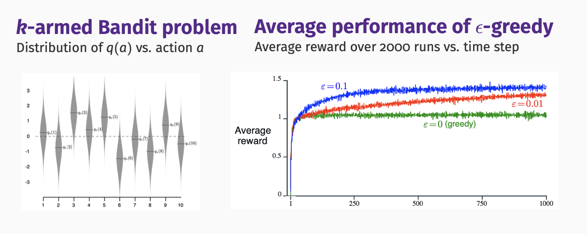
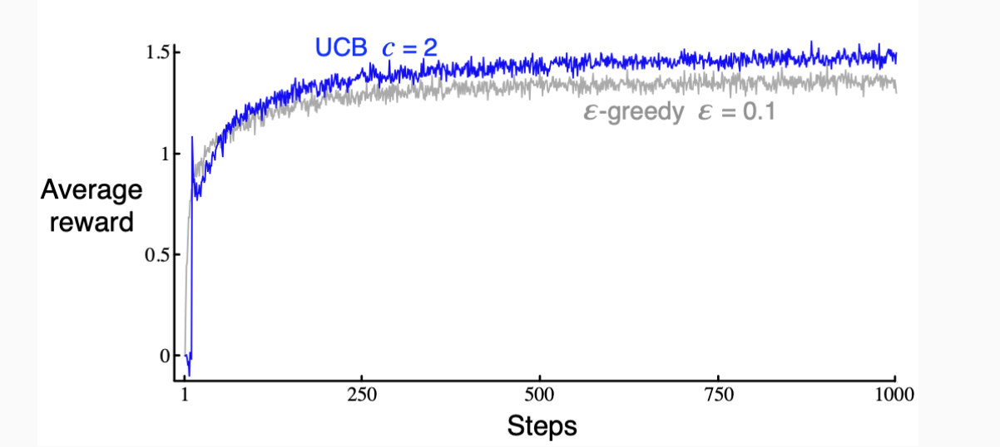
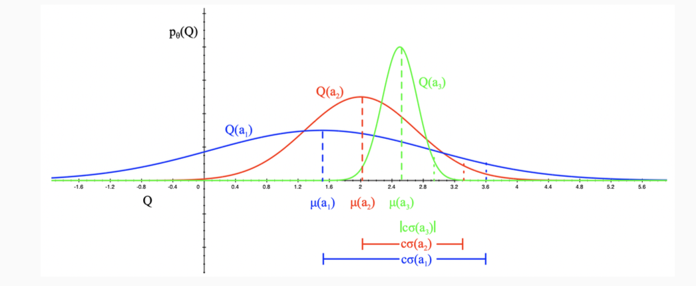
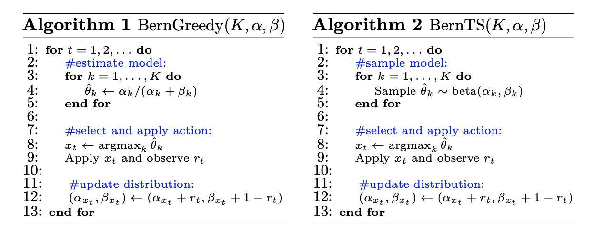

# <strong> Multi-armed Bandits  </strong>

Multi-Armed Bandit (MAB) is a machine learning framework in which an agent has to select actions/arms in order to maximize its cumulative reward in the long term. In each round, the agent receives some information about the current state, then it chooses an action based on this information and the experience gathered in previous rounds. At the end of each round, the agent receives the reward associated with the chosen action. 

One real-world example of a multi-armed bandit problem is when a news website has to make a decision about which articles to display to a visitor. With no information about the visitor, all click outcomes are unknown. The first question is, which articles will get the most clicks? And in which order should they appear? The website's goal is to maximize engagement, but they have many pieces of content from which to choose, and they lack data that would help them to pursue a specific strategy.

## Formalism of Multi-armed Bandits

- $Exploration$: maximize performance using current knowledge
- $Exploitation$: increase knowledge

#### Problem Statement:
- The agent is faced repeatedly with a choice among k different actions/arms
- At each step t the agent selects an action $a_t$
- After each choice it receives a numerical reward $r_t$ that depends on the action selected
- The reward distribution of action a - $p(r|a)$ is fixed but unknown
- Goal is to maximize cumulative reward: $\sum_{i=1}^tr_i$

In our multi-armed bandit problem, each of the k actions has an expected or mean reward given that that action is selected. It is called the $value$ of that action:

$$
\begin{aligned}
q_*(a) = E(r|a)
\end{aligned}
$$

If we know the value of each action, then it would be trivial to solve the k-armed bandit problem because we would always select the action with highest value. Thus we assume we don't know the reward distribution of each action, and we will use estimated value of action a at time step t - $q_t(a)$ instead.

$$
\begin{aligned}
Expected\ Value: q_*(a) = E(r|a) = \lim_{t\rightarrow+\infty}\frac{1}{t}\sum_{i=1}^{t}r_i|a \\
Sample\ Average: q_t(a) = \frac{sum\ of\ rewards\ when\ a\ taken\ prior\ to\ t}{number\ of\ times\ a\ taken\ prior\ to\ t}
\end{aligned}
$$

With the `greedy policy`, we will select an action for each round based on the rule below:

$$
\begin{aligned}
a_t = \argmax_{a} q_t(a)
\end{aligned}
$$

#### Incremental Implementation:

$$
\begin{aligned}
q_t &= \frac{1}{t} \sum_{i=1}^t r_i \\
    & = q_{t-1}(a) + \frac{1}{t}(r_t - q_{t-1}(a))
\end{aligned}
$$

For non-stationary problems (where the expected action value changes over time), the agent can track $q(a)$:

$$
\begin{aligned}
q_t(a) = q_{t-1}(a)+\alpha\left(r_t-q_{t-1}(a)\right)
\end{aligned}
$$

## $\epsilon$-greedy Method

- Greedy selection always exploits current knowledge on q-values to maximize reward, it never explores
- Alternative: behave greedily most of the time, but every once in a while select a random action

$\epsilon$-greedy algorithm:

- select random action (explore) with $p = \epsilon$
- select greedy action (exploit) with $p = 1 -\epsilon$

When all actions are sampled indefinitely:

$$
\begin{aligned}
\lim_{t\rightarrow+\infty} q_t(a) = q(a)
\end{aligned}
$$

#### Pseudo-code:

- Initialize, for a = 1, 2, ..., k:
  - q(a) = 0
  - n(a) = 0
- Loop forever:
  - a = random action with $p = \epsilon$
  - or $\argmax q(a)$ with $p = 1 - \epsilon$
  - Execute a, observe r
  - $n(a) += 1$
  - $q(a) += (r - q(a))$ * 1/n(a) 

Example: 10-armed testbed

#### Total Regret

The regret is the opportunity loss at step t: 

$$
\begin{aligned}
true\ optimal\ value: v_* = max_a\ q(a) \\
regret\ at\ time\ step\ t = v_* - q(a_t)
\end{aligned}
$$

The best trade-off between exploration and exploitation is the one that minimize total regret $L_t$:

$$
\begin{aligned}
L_t=\sum_{i=1}^t\left(v_*-q\left(a_i\right)\right)
\end{aligned}
$$

Note that the agent cannot measure regret directly, but regret can be used to analyze different RL algorithms on solved problems.

## Upper Confidence Bound Method

$\epsilon$-greedy action selection forces the non-greedy actions to be tried, but indiscriminately, with no preference for those that are nearly greedy or particularly uncertain, while UCB selects among the non-greedy actions according to their potential for actually being optimal, taking into account both how close their estimates are to being maximal and the uncertainties in those estimates: 

$$
\begin{aligned}
a_t & = \argmax_{a} \llbracket q_t(a) + u_t(a)\rrbracket\\
& = \argmax_{a} \llbracket q_t(a) + c\sqrt{\frac{\ln t}{N_t(a)}}\rrbracket
\end{aligned}
$$

- Uncertainty depends on number of times an action is selected
  - $Small\ N_t(a) \rightarrow Large\ u_t(a)$, estimated q-value is uncertain
  - $Large\ N_t(a) \rightarrow Small\ u_t(a)$, estimated q-value is accurate
  
- UCB guarantees all actions will be explored without the need to manually predefine an $\epsilon$ schedule.

Example: 10-armed testbed with USB

As shown, USB generally performs better than $\epsilon$-greedy action selection, except in the first k steps, when it selects randomly among the as-yet-untried actions.

## Bayesian Bandit

Bayesian bandit models the full distribution of rewards:
- Bayesian bandit tracks a `parameterized` distribution function of expected reward $p(E(r)|\theta, a)$, called likelihood function
- Selects actions based on $p(E(r)|\theta, a)$, e.g., using UCB
- Uses reward observed to update posterior distribution of $\theta$:

$$
\begin{aligned}
    p_t(\theta \mid r) \propto p(\mathbb{E}(r) \mid \theta, a) \times p_{t-1}(\theta \mid r)
\end{aligned}
$$

For example, $\theta = (\mu, \sigma)_a$ if $p(E(r)|\theta, a)$ are Gaussian distributions.

Example: Bayesian Bandit with UCB

- Define likelihood function $p(E(r)|\theta, a)$ as Gaussians
- Estimate upper confidence from posterior using $u_t(a) = c\sigma_t(a)$ where $\sigma_t(a)$ is the standard deviation of $p_\theta(q(a))$
- Select action $a_t=\underset{a}{\arg \max }\left(q_t(a)+c \sigma_t(a)\right)$

#### Bandit with Thompson Sampling

Instead of selecting actions from q-values with highest mean according to $p_{\theta}(q(a))$ with $\epsilon$-greedy or UCB, Thompson sampling explicitly samples q-values from $p_{\theta}(q(a))$ 

Example: Beta-Bernoulli Bandit

Suppose there are K actions, and when played, any action yields either a success(+1) or a failure(+0). Action $k \in {1,2,..,K}$ produces a success with probability $\theta_k \in [0,1]$. The mean rewards $\theta=\left(\theta_1, \ldots, \theta_K\right)$ is fixed but unknown. 

Let the agent begin with an independent prior belief over each $\theta_k$. Take these priors to be beta-distributed with parameters $\alpha = \left(\alpha_1, \ldots, \alpha_K\right)$ and $\beta = \left(\beta_1, \ldots, \beta_K\right)$. In particular, for each action k, the prior probability density function of $\theta_k$ is:

$$
p\left(\theta_k\right)=\frac{\Gamma\left(\alpha_k+\beta_k\right)}{\Gamma\left(\alpha_k\right) \Gamma\left(\beta_k\right)} \theta_k^{\alpha_k-1}\left(1-\theta_k\right)^{\beta_k-1}
$$

As observations are gathered, the distribution is updated according to Bayes' rule. it is particularly convenient to work with beta distribution because of their conjugacy properties. In particular, each action's posterior distribution is also beta with parameters that can be updated according to a simple rule:

$$
\left(\alpha_k, \beta_k\right) \leftarrow \begin{cases}\left(\alpha_k, \beta_k\right) & \text { if } x_t \neq k \\ \left(\alpha_k, \beta_k\right)+\left(r_t, 1-r_t\right) & \text { if } x_t=k\end{cases}
$$

The greedy method for Beta-Bernoulli Bandit is shown in Algorithm 1. Thompson sampling, proceeds similarly, as presented in Algorithm 2. The only difference is that the success probability estimate $\hat{\theta_k}$ is randomly sampled from the posterior distribution, which is a beta distribution with parameters $\alpha_k$ and $\beta_k$, rather than taken to be the expectation $\alpha_k/(\alpha_k + \beta_k)$. 

Thompson sampling process incorporates the uncertainty of the estimate into decision making to allow better exploration. It has been shown to efficiently trade-off exploring the set of available arms with offering arms more probable to be successful by Kaufmann et al (2012). There has been considerable success achieved by Thompson sampling of Ferreira et al.(2018), and it has empirically outperformed other multi-arm bandit approaches (Chapelle and Li, 2011).

## References:

- https://web.stanford.edu/~bvr/pubs/TS_Tutorial.pdf
- Reinforcement Learning by Richard S. Sutton and Andrew G. Barto